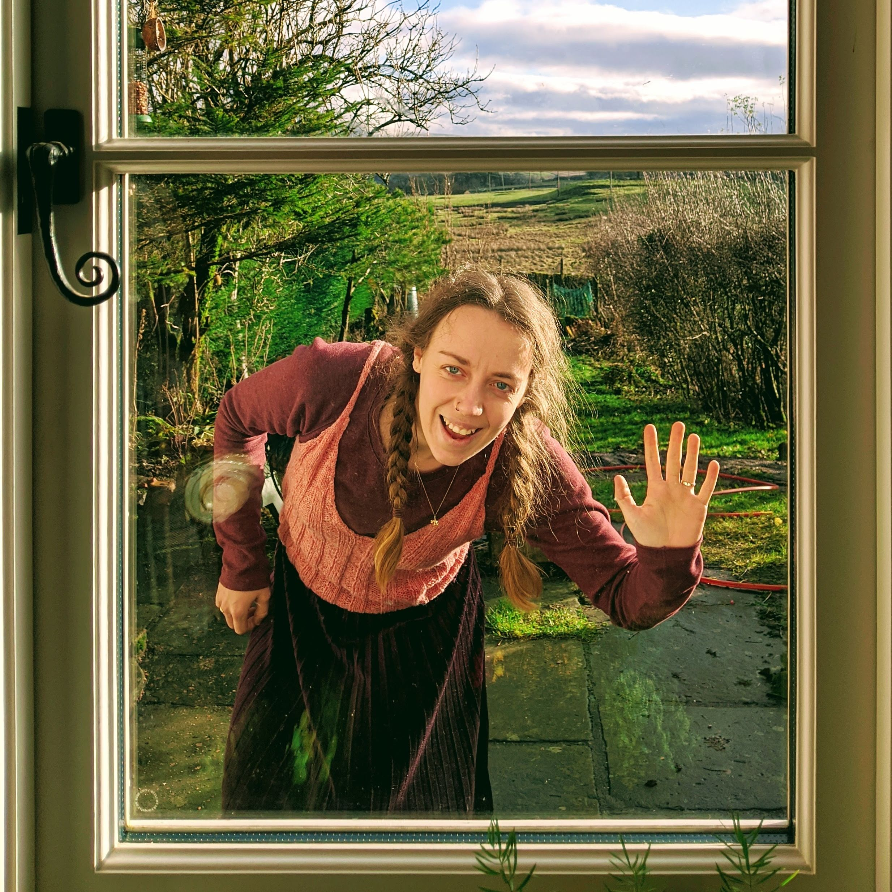
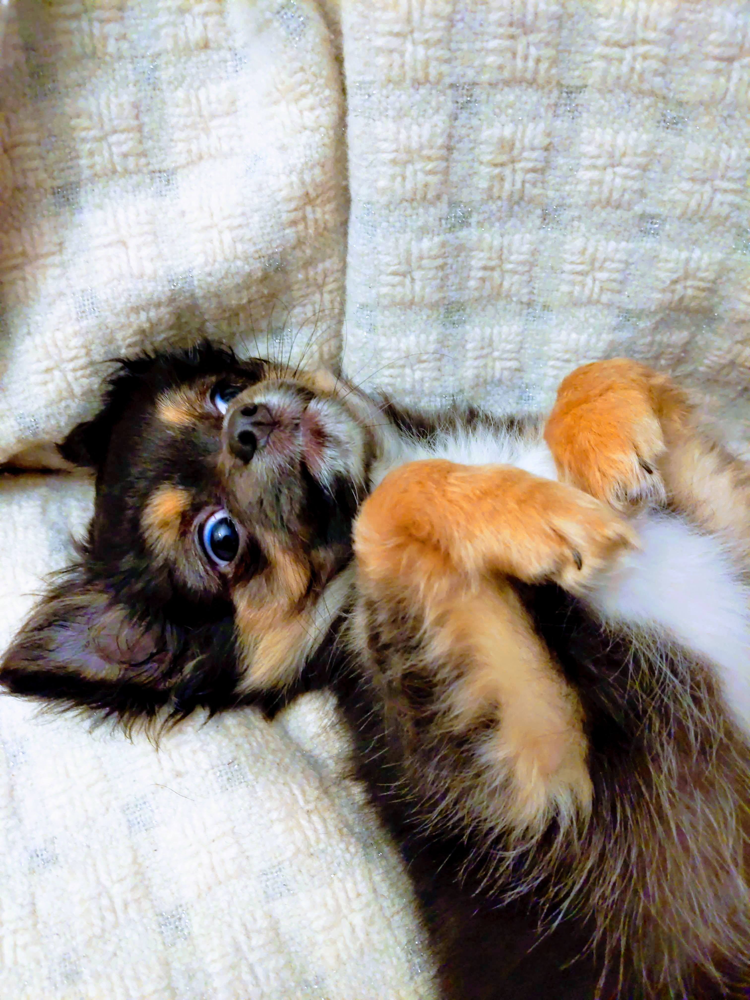
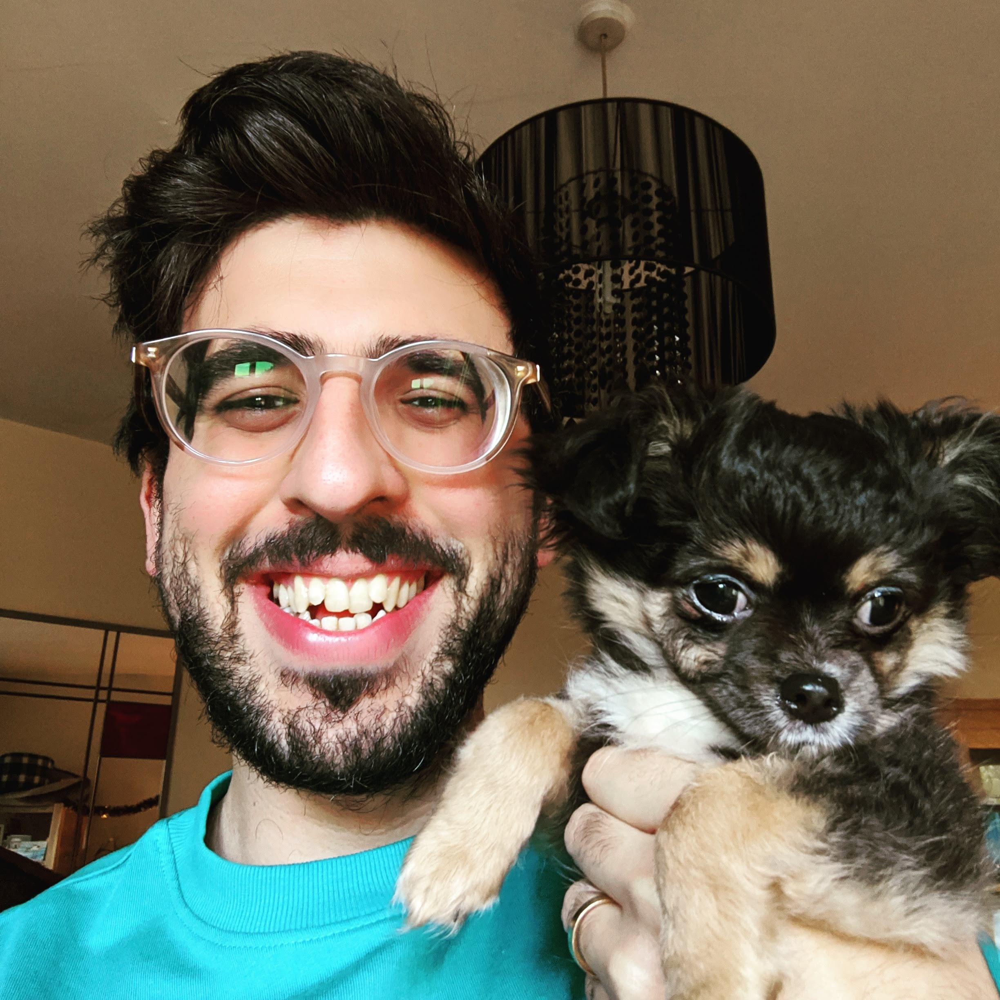

I really enjoy reading yearly reviews of interesting people's lives. I'm not claiming to be interesting, but I do think the exercise of looking back and reflecting on the year
is useful and therapeutic. So here it is, in no particular order, off the top of my head, everything I've done (or remember I've done) last year and what I learned from it.

## Personal

- In August I got married to my absolute favourite person in the whole world. We had a lovely party with family and friends from Manchester, Kent, Spain and Argentina. I still can't believe how lucky I am to have found Harriet and she agreed to marry me. I don't feel like our relationship has changed since we got married, we didn't need to demonstrate our commitment to each other, but it was nice to celebrate it with the people we love.

- In November we welcomed Tofu to our family. He's long-haired Chihuahueño puppy and the best dog one could ask. I never had a dog so I'm still getting used to it, but he's brought so much joy to our lives already.

- This was the year I fully grasped the tremendous scale and importance of the climate crisis, mostly thanks to books like "This Changes Everything" by Naomi Klein, "21 Lessons for the 21st Century" by Yuval Noah Harari and "The Uninhabitable Earth" by David Wallace-Wells. This realisation put the environment as a central concern and it's become the main driving force for big decisions in my life. I feel like I've stopped thinking in short vs. long terms. There won't be a long term if we don't change the way we live **now**. On the other side of the coin, this has also been a great source of anxiety.
- Even though I've been (mostly) vegan and fairly environmentally conscious for the last 3 years, this year my views on these topics gained a lot more nuance and I understand better now the effect my choices as an individual have. I've been focusing on sharing what I've learned with the people around me in an empathetic and non-confrontational way. It's rewarding to see my parents, friends and coworkers being influenced by my ideas and choices.
- Earlier this year I developed a pretty healthy morning routine and reading habit but I don't know at what point or why I broke the chain and lost all my momentum. I never picked it back up.
- I mostly stopped using social media apps during the middle part of the year and now that I started using them again (don't remember why, probably to share pictures of the puppy) I can see a lot better how unhappy they make me and how much I'm **not** missing out.
- Once again I'm amazed at my resourcefulness when it comes to finding ways of procrastinating and wasting time on the internet. Neverending chains of YouTube videos have been a problem. Accumulating articles to read later (and never reading them) has been a problem. I'm trying to improve this by consuming media in a more intentional and critical way. I want to start writing and thinking more about what I read/watch/listen to.
- The political situation in the UK (Brexit and the conservative, corrupt and racist government) was a pretty big blow for me. I don't know what's going to happen yet but I guess leaving the UK is back on the table...
- Even though I cycle to work every day and I'm relatively healthy, I feel unfit and overweight. I also struggled with pain on my right knee that stopped me from running (although it was mostly lazyness). This year I need to find a way of integrating exercise into my routine, I'm not in my 20s anymore.

## Work

- In April I changed jobs from a back-end engineer at BBC to a consultant at Infinity Works. I'm liking it so far, I've learned loads from my colleagues and added a new dimension to my skillset by interacting a lot more with clients and being exposed more to the commercial aspect of software engineering.
- I picked up Golang and feel fairly fluent with it. I love the minimalism of its API, how well designed its standard library is and how certain language features enforce best practices. I'd say it's become my programming language of choice.
- I fully embraced working with serverless technologies and got certified as an AWS Solutions Architect. I definitely feel like I leveled up my engineering skills this year, I'm quite happy with that.
- On the other hand I feel like I lost a lot of passion and interest for programming. I can see now how consulting can make you feel a bit like a mercenary and if the project/client you're assigned to is not great or you can't influence it that much, it becomes quite frustrating and draining. Haven't figured out what to do about this yet.

## Reading

- I set myself the unambitious goal of reading 30 books this year and I was on track for the first half, but as I mentioned before I lost all my momentum. I probably ended the year in the low 20s which is not terrible but it could have been a lot more.
- Reread Dune by Frank Herbert. Still amazing. I can't bring myself to read the next books because I know they will disappoint me.
- Finally started reading His Dark Materials by Phillip Pullman and I can't believe how good those books are. I wish I read them when I was younger, they are **a million** times better than Harry Potter, but I'm still enjoying them as a grown-ass man.
- I discovered the Books of Babel series by Josiah Bancroft and they are so much fun. They are modern Jules Verne-style adventures (minus the casual 19th century racism)[1] that take me back to my childhood.
- Read American Psycho by Brett Easton Ellis and I still haven't showered enough times to get it off my system.
- As I mentioned before, I really enjoyed reading Naomi Klein, Yuval Noah Harari and David Wallace-Wells. I really enjoy books on the intersection of environmentalist thinking, history, behavioural economics and psychology.
- Happy City by Charles Montgomery is a great/depressing read if you feel like your city is poorly designed and is trying to kill you (mine is).
- With my current struggles with the use of social media, Digital Minimalism by Cal Newport deserves a reread.

## Film and TV

- My favourite films of the year were: The Favourite, Spiderman Into The Spiderverse, Booksmart, Marriage Story, John Wick 3, Sorry We Missed You.
- I didn't go to the cinema as much as I'd like. I also noticed that I've only seen films that I knew I would probably like. I'd like to go see more films with no expectations whatsoever. And more films from non-English speaking countries.
- My absolute favourite TV show this year was Watchmen. I will write more about it soon, but I think it's, together with Years and Years, the defining show of 2019. The bold storytelling, the themes it explored, the density of information, the acting, the soundtrack, the respect and lack of respect for the original material, the ending. Everything was outstanding and it makes me sad that nobody around me seems to have seen it 😔
- I also enjoyed Fleabag, Years and Years, Killing Eve, Last Week Tonight with John Oliver and Chernobyl.

## Music

- My taste in music changed a lot this year, completely transitioning towards Jazz and instrumental music.
- My most listened artist of the year was Khruangbin.
- The way I listen to music also changed a lot thanks to Spotify. Since I started to listen to jazz almost exclusively, their recommendation algorithm got really good and I discovered tons of new bands and sounds I would have never done on my own.
- But I still really enjoy listening to albums. My favourites were:
  - Straight, No Chaser by Thelonius Monk
  - The Sidewinder by Lee Morgan
  - Time Out by The Dave Brubeck Quartet
  - Kind of Blue by John Coltran
  - Moaning by Art Blakey and the Jazz Messengers
  - Harmony of Difference by Kamasi Washington
- I started experimenting with creating monthly playlists[2] with new stuff I discover. I definitely will keep doing this because it's a lot of fun.
- But the playlist I'm most proud of is one I made inspired by the soundtrack of the game Persona 5. It's mostly synh-lead jazzy tunes with coffee shop vibes. Have a listen:

<iframe src="https://open.spotify.com/embed/playlist/23jNUeIgsX53Pfap6ppCgZ" width="300" height="380" frameborder="0" allowtransparency="true" allow="encrypted-media"></iframe>

## Games

- This is the year I fully embraced board games as my main hobby. Mostly thanks to my friend Iain getting me into Arkham Horror LCG.
- I finally got the hang of selecting the type of games Harriet and I both enjoy. Azul, Quacks of Quedlinburg, Patchwork, Carcassone, Dominion and Jaipur have been our favourites.
- I even managed to get my mother-in-law into boardgames! My next goal is to convince more friends to play with us when they come home for dinner.
- I sold my PS4 (and TV) because I didn't use it very often, so now the Switch is my main console.
- I'm still playing (and loving) The Legend of Zelda Breath of the Wild. This time, after 150 hrs. and 2 new games, I will definitely finish it. Although I doubt I'll bother to find all the Koroks.
- I also enjoyed Wilmot's Warehouse, Untitled Goose Game, Celeste, Grindstone, Hollow Knight, Overcooked 2 and Graveyard Keeper (good God this game is addictive).

## Conclusion

I think from a historical point of view, 2019 was a dumpster fire of a year for humanity and planet Earth. On the other hand, we got Greta Thunberg and the youth-lead environmental movement has gained a lot of relevance. It will be interesting to see how if it can keep gaining momentum this year, I'd like to contribute to that.

Personally, even though I've suffered from a lot of anxiety and general aimlessness, I think it was a positive year. I'm incredibly privileged to have a happy family, we are healthy and economically stable. My only fixed goal for 2020 is to not take this for granted, be grateful and help others as much as I can.

## Footnotes

1. Apparently the translations of Verne's books to English [are really bad](https://www.theguardian.com/books/booksblog/2007/sep/11/julesvernedeservesabetter).
2. Here are some examples: [October](https://open.spotify.com/playlist/1oNBb3vIJez8FwAWJFeBIM?si=rLRVqiopTuS9GuHXF402WA), [November](https://open.spotify.com/playlist/0AsXZY4KvB1TXdUbK3fmcs?si=4XRa0RsdTyi4JHrZQwtJZA), [December](https://open.spotify.com/playlist/0QPvT8kiVdppmpSxCE9ugl?si=XuMLQP9kS-OsE8RnEJwh8A)
